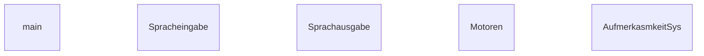
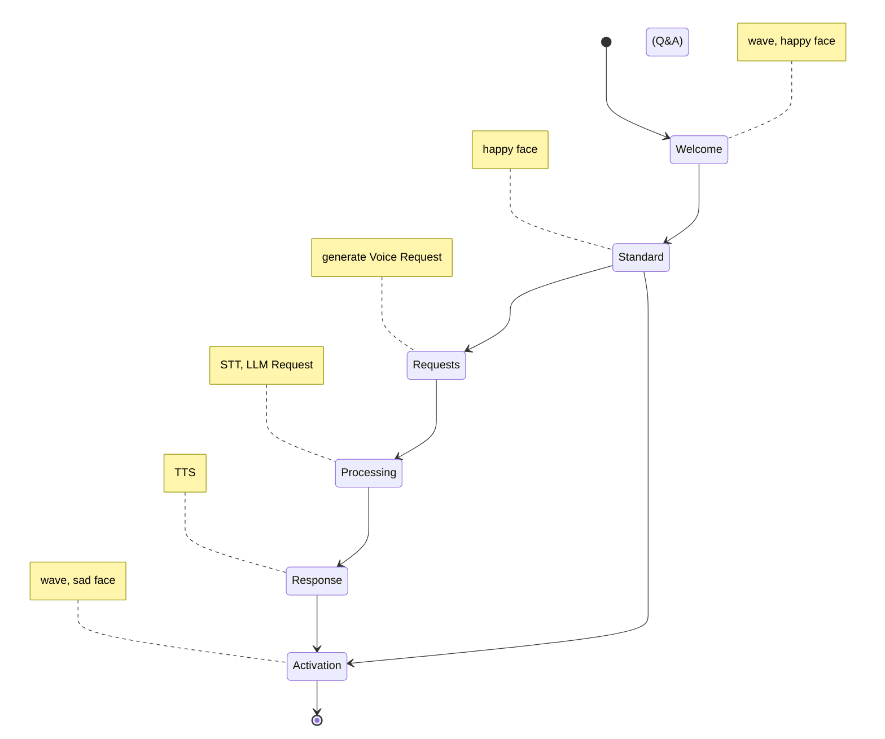

# education Bot

## Structur



## State Machine


## ER-Modell
```mermaid
erDiagram
    Bot ||--o{ State : "Operates in"
    Bot ||--o{ Functionality : "Supports"
    Bot ||--o{ Sensor : "Equipped with"
    Bot ||--o{ Display : "Uses for interaction"
    User ||--o{ Bot : "Interacts with"

    State {
        string name
        string description
        string emotion
    }
    Functionality {
        string name
        string description
    }
    Sensor {
        string type
        string purpose
    }
    Display {
        string type
        string size
    }
    User {
        int id
        string name
    }
